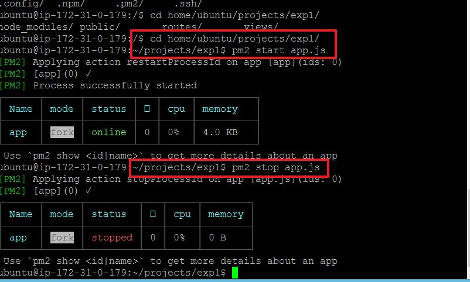

```js
Windows 7 기준
0. putty.zip 다운로드  
//윈도우에서는 ppk파일로 변환해주기 위해 푸티를 사용

1. ~.pem -> ~.ppk
//푸티 압축파일 열어서 PuttyGen.exe파일 열고, 아마존 키를 업로드해서 변형
2. putty.exe 실행 / 설정
configuration > category >SSH > Auth 클릭 > .pem 업로드
> category > session > Host name 에 ubuntu@IP주소 적고
> saved sessions에 aws(예시)로 적고 save버튼 클릭 > open버튼 클릭
> putty.exe 더블클릭!!

// NVM 설치
$ curl -o- https://raw.githubusercontent.com/creationix/nvm/v0.33.6/install.sh | bash
$ source ~/.bashrc    //.이 앞에 붙으면 숨김파일
$ nvm install 8.9.1   //최신버전 nvm 인스톨
$ node -v             //노드버전 확인
$ npm i -g express-generator  //익스프레스 제너레이터 글로벌로 깔기
$ mkdir projects      //프로젝츠라는 폴더하나 생성
$ cd projects         //생성한 폴더로 들어가서
$ express --ejs exp1  //익스프레스를 이용해서 ejs템플릿으로 폴더하나 만들어주는데 그 폴더명은 exp1
$ cd exp1             //그 exp1폴더로 들어가서
$ npm i               //npm 환경을 일단 먼저 깔아주고
$ npm start           //npm 시작시키고
$ npm i -g pm2        //그 npm환경 안에서 글로벌로 pm2 인스톨
$ rm -r bin           //bin이라는 폴더하나 관리자권한(-r, -root)으로
강력하게 삭제
$ nano app.js         //nano에디터 이용해서 터미널에 app.js코드보자
app.listen(3000);
console.log("Server started!!!"); //두줄 기재하고 save
$ cat app.js          //cat으로도 볼수있다
                      //vi에디터로도 볼수있는데 종료하는게 esc + :wq
$ pm2 start app.js    //pm2로 app.js 서버에 돌려보자(영원히죽지않음)
$ pm2 stop app        //멈추게도 할수 있음.

```


