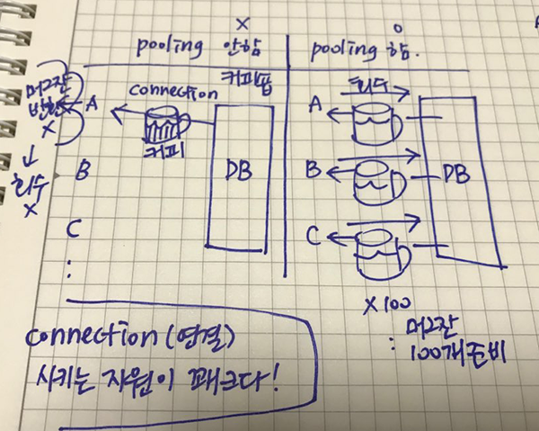
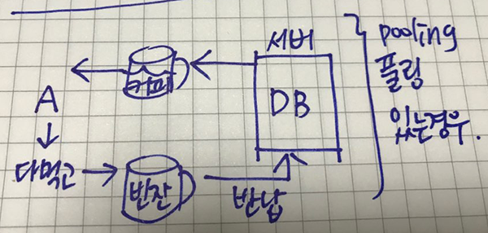
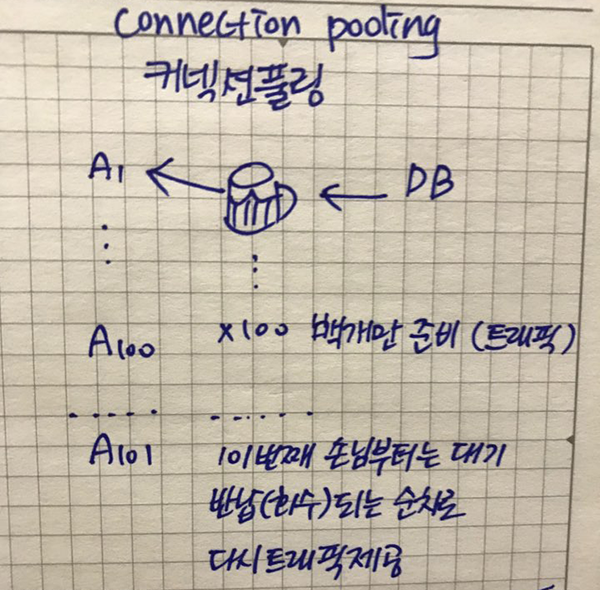
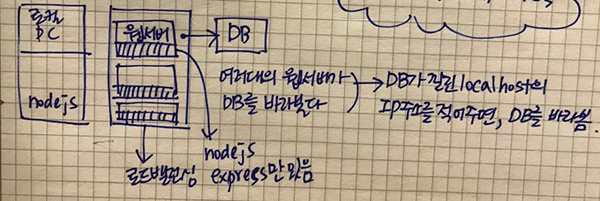

RDBMS, 관계형 데이터베이스
- nodejs, AWS:EC2

### 백엔드 서버
- 소프트웨어
- nodejs (=java)
- express (=spring)
- PC
    - nodejs, express
    - mariaDB - 2D table
    - Primary Key(PK)
    - 거의 모든 테이블에 PK가 있어야 함

```
회원
회원ID (PX)
...

게시판 테이블
글번호 (PK)
..
회원ID (FK, Foreign Key, 외래키) - 회원테이블의 회원ID과 관계연결
```
- FK를 통해 연결된 원래 회원테이블의 상세를 볼 수 있다.
---

SQL 쿼리
- Insert 저장
- Update 수정
- Delete 삭제
- Select 검색

---

웹서버 vs. 모바일서버
- 웹서버: 결과를 HTML로 돌려줌 //res.render()
- 모바일서버: 결과를 JSON으로 돌려줌 //res.json()


```
package.json
dependency{
    //필요한 모듈에 대한 정보가 정의,관리
}
```
```js
//일반객체
var person = new Object();
person.name = '홍길동';
person.age = 25;

console.log(person);

//JSON객체
var person2 = { 
    name: '홍길동', 
    age: 25 
};
console.log(person2);

//이와같은 방식으로 DB에 데이터를 넣는 방식이 MongoDB이다.
```


```js
const mysql = require('mysql');
const obj ={
    connectionLimit: 100, //최대 동시접속자 수
    host: 'localhost',
    user: 'root',
    password: '1234',
    database: 'test'
};

const pool = mysql.createPool(obj);

pool.getConnection((err,conn) => {  //관행적으로 첫번째 인자는 에러객체 err, 두번째는 연결객체 conn을 받음
    if(err) { return console.log('err= ', err); }
    console.log('conn', conn);
    conn.query('SELECT 1 + 1 as solution', 
    (err, rows) => {
        if(err) { return console.log('err= ', err); }
        console.log('rows = ', rows);
        console.log('rows[0] = ', rows[0]);
        console.log('rows[0].solution = ', rows[0].solution);
        conn.release(); //연결했던 자원을 다시 DB에 반납, pool을 하면 반드시 release 해줘야 함
    });
});
```

```js

// INSERT
const sql = "insert into member(id,name,email,tel) values(?,?,?,?)";
const arr = ['hong','홍길동','hong@aaa.com','010-1234-5678'];
pool.getConnection((err, conn) => {

    if (err) { return console.log('err= ', err); }
    //console.log('conn', conn);
    conn.query(sql, arr, (err, row) => { //여기서 저장이 됨
        console.log('저장 완료');
        conn.release();
    });
});
```

---

REST 방식(전송방식)
- get /URL  : SELECT
- post /URL : INSERT, UPDATE, DELETE
- put /URL : UPDATE
- delete /URL : DELETE

express에서
- router.get
- router.post

```
get     /users      : 모든 사용자 정보 얻기 -> SELECT * FROM users
예전엔) /users.php?list=all
get     /users/id   : SELECT * FROM users WHERE id=?  상세url로 디테일하게 들어가는 방식
예전엔) /users.php?id=hong

post    /users          : INSERT
post    /users/id       : UPDATE
post    /users/id/del   : DELETE
```

**REST방식은 협업하기 좋다.!
REST방식은 URL만 있다. 뒤에 .asp, .php등 붙지 않는다. 파일명만으로 찾아간다.**




- 커넥션풀링 시 유지하는데 트래픽 생성비용 제로

---

로드밸런싱(Load Balancing)
- 웹서버 여러대 띄워서, 한대가 죽어도 유지되도록 함




RDBMS, 관계형 데이터베이스
- nodejs : java
- express : spring
- 관계형 데이터베이스에서 각 테이블은 PK 연결고리가 존재(거의)
- 거의 모든 테이블에 PK가 존재

```
회원테이블           |           게시판테이블
회원ID(PK)                       글번호(PK)
                                 회원ID  (FK, 외래키)
```
- FK를 통해 원래 테이블의 데이터를 볼 수 있다

상관관계
- 1:1
    - 핵심정보 테이블 - 부가정보 테이블

1:다
```
부서 테이블      |     사원 테이블
부서번호 PK            사원번호 PK
```
만약 A사원이 10번 부서, B사원이 20번 부서, C사원이 10번 부서에 있다면,
즉, A데이터가 B데이터에 여러번 존재하고, 부서번호가 사원테이블의 FK로 왔을 때 1:다

다:다
```
회원테이블       |       상품테이블

     ->  구매테이블(파생)   <-
```
- 다:다 해소, 뭐든 1:다 로 만듬
- PK -> FK로 가면 1:다로 바뀜
- 다:다를 해소하는 중간테이블(파생)이 있다.


SQL
```
DELETE FROM 테이블명 WHERE 조건
DELETE FROM 테이블명 WHERE id='hong'

SELECT * FROM 테이블명
SELECT 컬럼명 FROM 테이블명
```
- SELECT 의 결과값은 배열로 나타난다
- JSON
```
{
    key: value
}
```
- *(all)을 선택하면 속도에 부하가 걸릴 수 있다(실무에선 사용안함)
```
SELECT id, name, email, tel FROM member
```
---

기획서 작성
- 기능, 화면, SQL


RESTful API
- 도메인에 GET방식으로 키값을 들고다니는 것은 옛날방식
- REST API로 개선하자!

REST방식
- GET방식 사용할 떄, URL 베이스
- URL로만 표현하는 것, 레스트방식
